A sample command-line application with an entrypoint in `bin/`, library code
in `lib/`, and example unit test in `test/`.

**KUIS 1**

1. Pada kode di soal kegunaan print untuk mencetak/menampilkan teks atau value yang terdapat
di dalam perintah print. Di mana pada nomor 1, teks di dalam perintah 'print' yaitu berisi
'Hello World'.

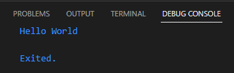

2. Pada soal nomor 2, terdapat tipe data String yang di mana tipe data ini digunakan untuk
menampung nilai dengan bentuk teks. Lalu, di bawahnya terdapat kode print('name') yang di mana
name di kode tersebut memanggil value dari name yang telah diisi dengan 'joko anton jodi'.

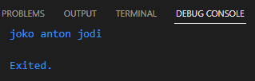

3. Sama halnya dengan nomor 2, tipe data String menyimpan nilai berupa teks/string dan pada
kode di atas menyimpan nilai 'joko', selanjutnya di bawahnya terdapat variabel yang dideklarasikan
sebagai final yang di mana tidak dapat diubah setelahnya dan variabel tersebut diberi nama
lastname dan menyimpan value 'anton jodi'. Lalu di bawahnya lagi, memanggil perintah print yang
di mana mencetak satu-satu dari firstname dan lastname

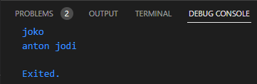

4. Pada soal nomor 4 terdapat eror karena pada baris kedua array2 dideklarasikan sebagai 'const'.
Sehingga menghasilkan output error sebagai berikut:

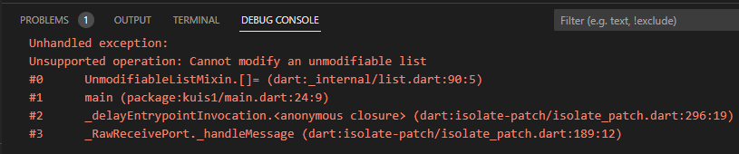

Jadi dibutuhkan solusi dengan mengganti kata kunci 'const' dengan yang lainnya misalnya mengganti 
dengan 'var' jadi code pembenarannya sebagai berikut:

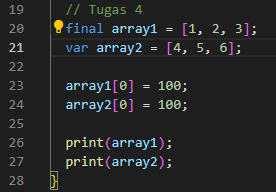

kata kunci 'final' pada array1 yang membuat variabel nilainya tidak dapat diubah setelah diinisalisasi.
Dan isi dari array1 berisi beberapa nilai yaitu [1, 2, 3]. Lalu, di bawahnya terdapat baris yang
mendeklarasikan array2 dengan kata kunci 'var', di mana 'var' ini kebalikan dari final yaitu nilai variabel
bisa dirubah setelah inisialisasi. Selanjutnya, pada baris ketiga terdapat pergantian nilai pada array1
dan indeks ke-0 dari nilai 1 menjadi 100. Begitu juga pada baris selanjutnya mengganti array2 indeks ke-0
dari 4 menjadi 100. Lalu di bawahnya terdapat perintah print untuk mencetak nilai terbaru dari array1 dan
array2.

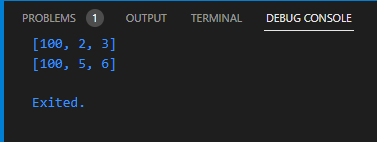

5. Pada soal tugas 4, baris pertama terdapat variabel bernama 'number1' dengan tipe data 'int'. Tipe data int
dapat menampung value bilangan bulat dan nilai dari number1 diinisialisasi dengan nilai 100. Begitu juga dengan
baris kedua terdapat variabel bernama 'number2' dengan tipe data 'double'. Tipe data double dapat menampung bilangan
desimal dan number2 diinisialisasi dengan nilai 100,5. Lalu terdapat sintaks print yang digunakan untuk mencetak
nilai dari number1 dan number2

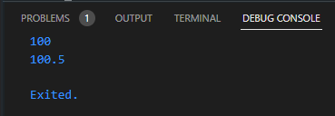

6. Pada tugas 5, baris pertama mendefinisikan sebuah variabel bernama 'number' dengan tipe data 'num'. Di mana tipe data 'num' dapat menampung semua bilangan baik bulat maupun pecahan. Lalu pada baris kedua memanggil sintaks print untuk mencetak nilai dari number. Pada baris ketiga, dilakukan pergantian nilai yang ada pada variabel dari 10 menjadi 10,5. Hal tersebut dapat terjadi karena tipe data 'num' memungkinkan perubahan tersebut yaitu merubah bilangan bulat menjadi bilangan pecahan. Lalu di baris selanjutnya, memanggil sintaks print untuk mencetak nilai dari variabel 'number' yang telah diperbarui.

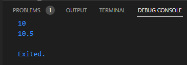

7. Pada tugas 6, baris pertama terdapat variabel 'firstName' dengan tipe data 'String'. Begitu juga dengan baris kedua terdapat variabel 'lastName' dengan tipe data 'String'. Dan pada baris ketiga terdapat sebuah variabel baru yang bernama fullName yang digunakan untuk menggabungkan (konkatenasi) dua string yaitu firstName dan lastName menggunakan interpolasi string.

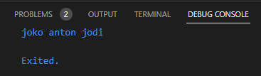

8. Pada tugas 7, baris pertama merupakan cara mengaplikasikan penggunaan "\'" yang di mana digunakan menyisipkan tanda kutip tunggal pada sebuah string. Lalu di bawahnya terdapat sintaks untuk mencetak value dari variabel 'text'.

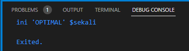

9. Pada tugas 8, baris pertama terdapat sebuah variable 'name1' di mana menggabungkan value dari variabel firstName dan lastName menjadi satu. Sedangkan, pada baris kedua terdapat variabel 'name2' di mana memiliki value string yaitu 'joko', 'anton', dan 'jodi'. Lalu di bawahnya, terdapat sintaks print untuk mencetak value dari variabel name1 dan name2.

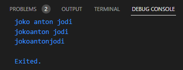

10. Pada tugas 9 merupakan bentuk yang disempurnakan dari tugas 8 di mana menambahkan spasi setelah kata 'joko'. Pada baris pertama menambahkan " " di tengah-tengah dari firstName dan lastName. Dan pada baris kedua menambahkan spasi di setiap stringnya seperti berikut ' anton'. Lalu di bawahnya diberi sintaks print untuk mencetak value dari name1 dan name2.

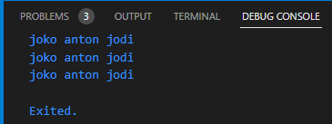

11. Pada tugas 10 terdapat penggunaan tanda kutip tiga (''') yang di mana digunakan untuk membuat string yang multiline. Dan pada kode di soal diinisialisasi dengan variabel bernama 'kalimat_panjang'. Dan di bawah menggunakan sintaks print untuk mencetak variabel 'kalimat_panjang'.

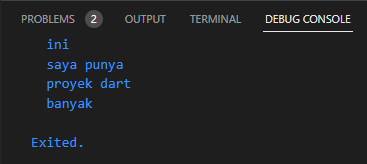

